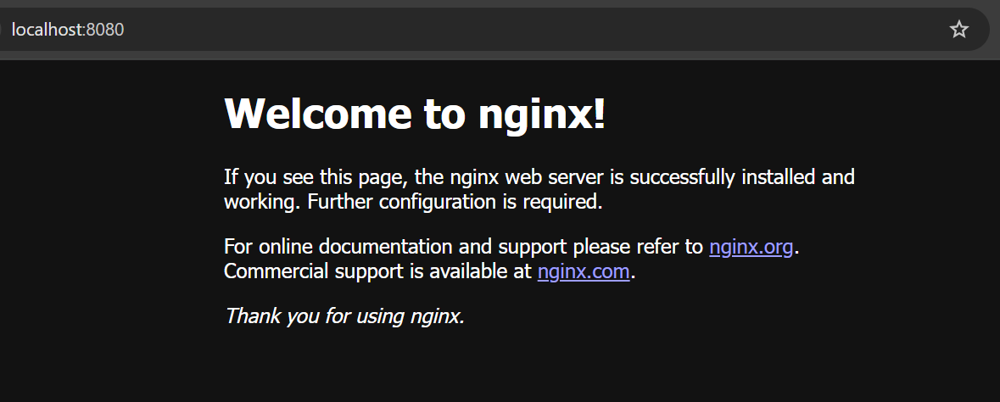

# Nginx - Installation

[Back](../README.md)

- [Nginx - Installation](#nginx---installation)
  - [Installation](#installation)
  - [Dockerization](#dockerization)
    - [Default](#default)
    - [Customer Page and Config](#customer-page-and-config)

---

## Installation

- Ref: https://docs.nginx.com/nginx/admin-guide/installing-nginx/installing-nginx-open-source/

```sh
# Ubuntu
sudo apt update -y && \
sudo apt install -y nginx

# RHEL
sudo dnf update -y && \
sudo dnf install -y nginx


# confirm
sudo nginx -v
# nginx version: nginx/1.24.0 (Ubuntu)

# find out the path to NGINX configuration file, error log, and access log files
nginx -V 2>&1 | awk -F: '/configure arguments/ {print $2}' | xargs -n1
# --conf-path=/etc/nginx/nginx.conf: path to the nginx.conf configuration file
# --error-log-path=stderr: the path to the error log
# --http-log-path=/var/log/nginx/access.log: the path to the access log

# confirm service
sudo systemctl status nginx
```

- Visit HTML



---

## Dockerization

- ref: https://docs.nginx.com/nginx/admin-guide/installing-nginx/installing-nginx-docker/#using-nginx-open-source-docker-images

### Default

```sh
# default
docker run -it -d --rm -p 8080:80 --name web nginx

docker stop web
```

- Docker Compose

```yaml
# default
services:
  nginx:
    image: nginx
    container_name: nginx-web
    restart: always
    ports:
      - 8080:8080
```

```sh
docker compose up -d
```

---

### Customer Page and Config

- Default directory:
  - `/usr/share/nginx/html`
- Default Configuration File:
  - `/etc/nginx/conf`

```sh
# custom html and config
docker run -it -d --name mynginx2 -v ./html:/usr/share/nginx/html:ro -v ./nginx/nginx.dev.conf:/etc/nginx/conf:ro  -p 8081:80 nginx
```

- Docker compose

```yaml
services:
  nginx:
    image: nginx
    container_name: nginx-web
    restart: always
    ports:
      - 8080:8080
    volumes:
      - ./html:/usr/share/nginx/html
      - ./nginx/nginx.dev.conf:/etc/nginx/nginx.conf:ro
```
