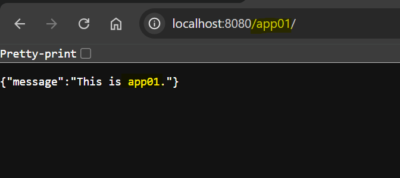
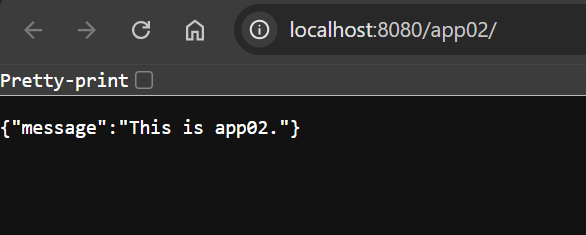

# Nginx - Reverse Proxy

[Back](../README.md)

- [Nginx - Reverse Proxy](#nginx---reverse-proxy)
  - [FastAPI App](#fastapi-app)
    - [Docker Compose](#docker-compose)
  - [Nginx Configuration](#nginx-configuration)

---

## FastAPI App

- api show the evn var used to indicate different apps.

```py
import os
from fastapi import FastAPI

app = FastAPI(title="FastAPI App", version="1.0.0")


@app.get("/")
async def read_root():
    app_name = os.getenv("APP_NAME")
    return {"message": f"This is {app_name}."}      # show env var

if __name__ == "__main__":
    import uvicorn
    uvicorn.run(app, host="0.0.0.0", port=8000)

```

---

### Docker Compose

```yaml
services:
  app01:
    container_name: app01
    build: ./app/
    restart: unless-stopped
    environment:
      - APP_NAME=app01
      - ENV=development
    volumes:
      - ./app:/app
    networks:
      - app-network

  app02:
    container_name: app02
    build: ./app/
    restart: unless-stopped
    environment:
      - APP_NAME=app02
      - ENV=development
    volumes:
      - ./app:/app
    networks:
      - app-network

  nginx:
    container_name: nginx-web
    image: nginx:latest
    restart: unless-stopped
    ports:
      - 8080:8080
    volumes:
      - ./nginx/nginx.conf:/etc/nginx/nginx.conf:ro
    depends_on:
      - app01
      - app02
    networks:
      - app-network

networks:
  app-network:
    driver: bridge
```

## Nginx Configuration

- Nginx CF

  - use service name defined in Docker Compose to identify the proxy target.
  - use `proxy_pass` to implement reverse proxy.

- Note:
  - `location` should be the path `/app01/` not the file `/app01`.
  - `proxy_pass` should be the path `http://app01:8000/`, which requests `/` in FastAPI, not the `http://app01:8000` which reqeusts `/app01/` in FastAPI.

```conf
events {}

http {
    server {
        listen 8080;
        server_name localhost;

        # reverse proxy
        location /app01/ {
            proxy_pass http://app01:8000/;
        }

        location /app02/ {
            proxy_pass http://app02:8000/;
        }
    }
}
```

- Test:

- http://localhost:8080/app01



- http://localhost:8080/app02


