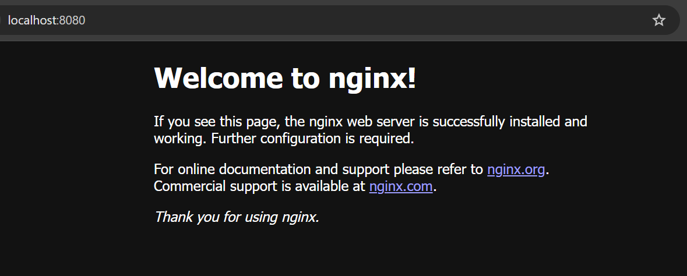

# Nginx - Web Server

[Back](../README.md)

- [Nginx - Web Server](#nginx---web-server)
  - [Docker](#docker)
  - [Nginx Configuration - Web Server](#nginx-configuration---web-server)
    - [Virtual Servers](#virtual-servers)
    - [Server configuration block](#server-configuration-block)
      - [Listen Directive](#listen-directive)
      - [Locations directive](#locations-directive)
      - [Location Priority](#location-priority)
      - [Location Context](#location-context)
    - [Use Variables](#use-variables)
    - [Return Directive](#return-directive)
    - [Rewrite Directive](#rewrite-directive)
    - [sub\_filter directive: Rewrite HTTP Responses](#sub_filter-directive-rewrite-http-responses)
    - [error\_page directive: Handle Errors](#error_page-directive-handle-errors)

---

## Docker

- Default

```sh
# default
docker run -it -d --rm -p 8080:80 --name web nginx

docker stop web
```



- Customer Page

  - Default directory:
    - `/usr/share/nginx/html`

- Develope Example

```yaml
services:
  nginx:
    image: nginx
    container_name: nginx-web
    restart: always
    ports:
      - 8080:80
    volumes:
      - ./html:/usr/share/nginx/html # custom html
      - ./nginx/nginx.dev.conf:/etc/nginx/nginx.conf:ro # nginx cf
```

---

## Nginx Configuration - Web Server

### Virtual Servers

- configuration file must include **at least one** server directive to define a `virtual server`.
- defined by a server directive in the http context
- can add multiple server directives into the http context to define multiple virtual servers.

  ```conf
  http {
      server {
          # Server configuration
      }
  }
  ```

---

### Server configuration block

#### Listen Directive

- specify the **IP address** and **port** (or Unix domain socket and path) on which the server listens for requests.
- Both IPv4 and IPv6 addresses are accepted; enclose IPv6 addresses in square brackets.
- Example:

```conf
server {
    listen 127.0.0.1:8080;
    # Additional server configuration
}
```

- Default

  - If an **address** is **omitted**, the server listens on **all addresses**.
  - If a `port` is **omitted**, the `standard port` is used.
    - the **“standard” port** is `80/tcp` and the **“default” port** is `8000/tcp`, depending on superuser privileges.

- If there are **several servers** that **match** the `IP address` and **port** of the request, NGINX Plus tests the request’s **Host header** field against the `server_name` directives in the server blocks.

- Example: listens on all addresses and serveral servers.

```conf
server {
    listen      80;
    server_name example.org www.example.org;
    #...
}
```

---

#### Locations directive

- Used to send traffic to different proxies or serve different files based on the request URIs.

- location directive parameter types:

  - prefix strings(pathnames): must start with the prefix string.
  - regular expressions: preceded with the tilde (`~`) for **case-sensitive** matching, or the tilde-asterisk (`~*`) for **case-insensitive** matching.

- Example:

```conf
# prefix strings
location /some/path/ {
    #...
}

# regular expressions
location ~ \.html? {
    #...
}
```

---

#### Location Priority

- NGINX Plus **first** compares the URI to the locations with a `prefix string`. It **then** searches the locations with a `regular expression`.
- Higher priority is given to `regular expressions`, unless the `^~` modifier is used.
- Among the `prefix strings` NGINX Plus selects the **most specific one** (that is, the longest and most complete string).
- The logic for selecting a location:

  - 1. Test the URI against all `prefix strings`.
  - 2. The = (equals sign) modifier defines an exact match of the URI and a `prefix string`.
    - If the exact match is found, the search stops.
  - 3. If the `^~` (caret-tilde) modifier prepends the longest matching `prefix string`, the regular expressions are not checked.
  - 4. Store the longest matching `prefix string`.
  - 5. Test the URI against `regular expressions`.
  - 6. Stop processing when the first matching `regular expression` is found and use the corresponding location.
  - 7. If no `regular expression` matches, use the location corresponding to the stored prefix string.

- A typical use case for the `=` modifier is requests for `/` (forward slash).
  - If requests for `/` are frequent, specifying `= /` as the parameter to the `location directive` **speeds up processing**, because the search for matches **stops** after the first comparison.
  ```conf
  location = / {
      #...
  }
  ```

---

#### Location Context

- `location context`
  - contain directives that define **how to resolve a request**
    - either serve a **static file**
    - or **pass** the request to a **proxied server**.
- Example

```conf
server {
    location /images/ {
        root /data;  # files from the /data directory
    }

    location / {
        proxy_pass http://www.example.com; # passed to the proxied server that hosts content for the <www.example.com> domain.
    }
}
```

> in response to a request for `/images/example.png`, NGINX Plus delivers the file `/data/images/example.png`.
> all requests with URIs that do **not start** with `/images/` are be passed to the proxied server.

---

### Use Variables

- A variable is denoted by the `$` (dollar) sign at the beginning of its name.
- Variables define information based upon NGINX’s state, such as the properties of the request being currently processed.

- `predefined variables`
  - such as the core HTTP variables
- can define custom variables using the **set**, **map**, and **geo** directives.
- Most variables are computed at runtime and contain information related to a specific request.
  - For example, `$remote_addr` contains the **client IP address** and `$uri` holds the current **URI value**.

---

### Return Directive

- Some website URIs require immediate return of a response with a **specific error** or redirect code, for example when a page has been moved temporarily or permanently.

  - The easiest way to do this is to use the `return directive`.
  - For example:

  ```conf
  location /wrong/url {
      return 404;
  }
  ```

- The **first** parameter of return is a **response code**. The **optional second** parameter can be the **URL** of a redirect (for codes 301, 302, 303, and 307) or the text to return in the response body
  - example:
  ```conf
  location /permanently/moved/url {
      return 301 http://www.example.com/moved/here;
  }
  ```

---

### Rewrite Directive

- Used to modify a request URI during request processing.
- can include multiple rewrite directives in both the server and location contexts.
- 3 parameters:

  - 1st param: the regular expression that the request URI must match.
  - 2n param: the URI to substitute for the matching URI.
  - 3rd para: optional, a flag that can halt processing of further rewrite directives or send a redirect (code 301 or 302).

- Example:

```conf
location /users/ {
    rewrite ^/users/(.*)$ /show?user=$1 break;
}
```

---

### sub_filter directive: Rewrite HTTP Responses

- `sub_filter` directive

  - used to rewrite or change the content in an HTTP response, substituting one string for another.

- Example:

```conf
location / {
    sub_filter      /blog/ /blog-staging/;
    sub_filter_once off;
}
```

```conf
location / {
    sub_filter     'href="http://127.0.0.1:8080/'    'href="https://$host/';
    sub_filter     'img src="http://127.0.0.1:8080/' 'img src="https://$host/';
    sub_filter_once on;
}
```

> changes the scheme from `http://` to `https://` and **replaces** the localhost address with the hostname from the request header field.
> The `sub_filter_once` directive tells NGINX to apply `sub_filter` directives **consecutively** within a location

---

### error_page directive: Handle Errors

- `error_page` directive

  - used to return a **custom page** along with an error code, substitute a different error code in the response, or redirect the browser to a different URI.

- The error code can come from a proxied server or occur during processing

- Example:

```conf
error_page 404 /404.html;
```

> specifies the page (/404.html) to return with the 404 error code.

```conf
location /old/path.html {
    error_page 404 =301 http:/example.com/new/path.html;
}
```

> when NGINX Plus cannot find a page, it substitutes code 301 for code 404, and redirects the client to http:/example.com/new/path.html.

```conf
server {
    ...
    location /images/ {
        # Set the root directory to search for the file
        root /data/www;

        # Disable logging of errors related to file existence
        open_file_cache_errors off;

        # Make an internal redirect if the file is not found
        error_page 404 = /fetch$uri;
    }

    location /fetch/ {
        proxy_pass http://backend/;
    }
}
```

> passing a request to the back end when a file is not found. Because there is no status code specified after the equals sign in the error_page directive, the response to the client has the status code returned by the proxied server (not necessarily 404).
> `$uri` variable in the final parameter to the error_page directive holds the URI of the current request, which gets passed in the redirect.

---
