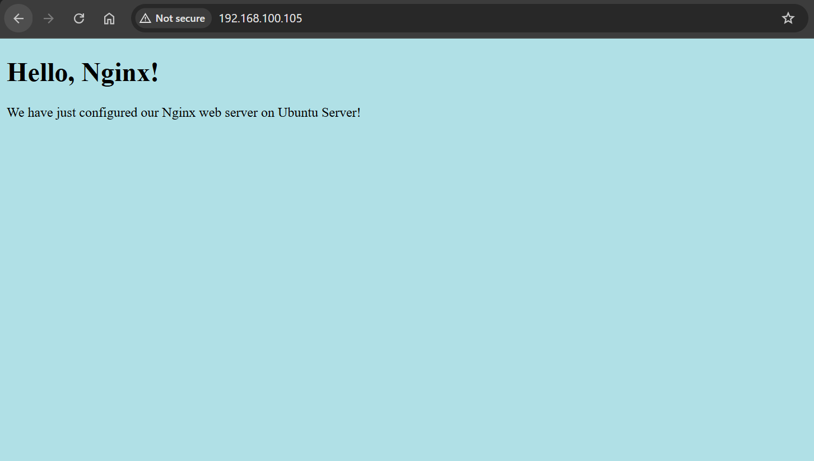

# Nginx - Web Server

[Back](../README.md)

- [Nginx - Web Server](#nginx---web-server)
  - [Common Directives](#common-directives)
    - [Lab: Return a Custom message](#lab-return-a-custom-message)
    - [Lab: Custom HTML](#lab-custom-html)
    - [Lab: Include MIME Type](#lab-include-mime-type)
    - [Lab: Include `*.conf`](#lab-include-conf)
    - [Lab: Temp Redirect `return 307`](#lab-temp-redirect-return-307)
    - [Lab: Temp Redirect without changing url `rewrite`](#lab-temp-redirect-without-changing-url-rewrite)
    - [Lab: Multiple Index Files](#lab-multiple-index-files)
    - [Lab: Define 404 html](#lab-define-404-html)
  - [Location](#location)
    - [Processing Order (Priority)](#processing-order-priority)
    - [Lab: Location](#lab-location)
      - [Prefix Match (no modifier)](#prefix-match-no-modifier)
      - [Exact Match](#exact-match)
      - [Regex](#regex)
      - [Regex Case Insensitive](#regex-case-insensitive)

---

## Common Directives

Server Block Configuration

| Directive                     | Desc                                    |
| ----------------------------- | --------------------------------------- |
| `server { }`                  | Define a virtual server                 |
| `listen 80;`                  | Port to listen on (80, 443, 8080, etc.) |
| `server_name example.com;`    | Domain names this server responds to    |
| `root /var/www/html;`         | Document root directory                 |
| `index index.html index.php;` | Default files to serve                  |

- Location Matching

| Location                        | Desc                           |
| ------------------------------- | ------------------------------ |
| `location / { }`                | Match all requests             |
| `location /api/ { }`            | Match specific paths           |
| `location ~ \.php$ { }`         | Regex match (case sensitive)   |
| `location ~* \.(jpg\|png)$ { }` | Regex match (case insensitive) |
| `location = /favicon.ico { }`   | Exact match                    |

- File Handling

| Directive                      | Desc                                         |
| ------------------------------ | -------------------------------------------- |
| `try_files $uri $uri/ =404;`   | Try files in order, return 404 if none found |
| `autoindex on;`                | Enable directory listing                     |
| `expires 30d;`                 | Set cache expiration headers                 |
| `add_header X-Custom "value";` | Add custom HTTP headers                      |

- Request Processing

| Directive                    | Desc                      |
| ---------------------------- | ------------------------- |
| `client_max_body_size 100M;` | Maximum upload size       |
| `client_body_timeout 60s;`   | Upload timeout            |
| `keepalive_timeout 65;`      | Connection keepalive time |
| `send_timeout 60s;`          | Response send timeout     |

- SSL/HTTPS

| Directive                            | Desc                     |
| ------------------------------------ | ------------------------ |
| `ssl_certificate /path/cert.pem;`    | SSL certificate file     |
| `ssl_certificate_key /path/key.pem;` | SSL private key          |
| `ssl_protocols TLSv1.2 TLSv1.3;`     | Allowed SSL protocols    |
| `ssl_ciphers HIGH:!aNULL:!MD5;`      | SSL cipher configuration |

- Logging

| Directive                                | Desc                |
| ---------------------------------------- | ------------------- |
| `access_log /var/log/nginx/access.log;`  | Access log location |
| `error_log /var/log/nginx/error.log;`    | Error log location  |
| `log_format combined '$remote_addr...';` | Custom log format   |

- Redirects and Rewrites

| Directive                                     | Desc               |
| --------------------------------------------- | ------------------ |
| `return 301 https://example.com$request_uri;` | Permanent redirect |
| `rewrite ^/old-url$ /new-url permanent;`      | URL rewriting      |
| `error_page 404 /404.html;`                   | Custom error pages |

- Proxy and Load Balancing

| Directive                                            | Desc                        |
| ---------------------------------------------------- | --------------------------- |
| `proxy_pass http://backend;`                         | Forward requests to backend |
| `proxy_set_header Host $host;`                       | Pass original host header   |
| `upstream backend {server ip:port; server ip:port;}` | Define backend servers      |

- Security and Access Control

| Directive                           | Desc                        |
| ----------------------------------- | --------------------------- |
| `allow 192.168.1.0/24;`             | Allow specific IP range     |
| `deny all;`                         | Deny all other IPs          |
| `auth_basic "Restricted Area";`     | Enable basic authentication |
| `auth_basic_user_file /etc/passwd;` | Password file location      |

- Performance Optimization

| Directive                         | Desc                       |
| --------------------------------- | -------------------------- |
| `gzip on;`                        | Enable compression         |
| `gzip_types text/plain text/css;` | File types to compress     |
| `sendfile on;`                    | Efficient file serving     |
| `tcp_nopush on;`                  | Optimize packet sending    |
| `worker_processes auto;`          | Number of worker processes |

- Rate Limiting

| Directive                                                    | Desc                   |
| ------------------------------------------------------------ | ---------------------- |
| `limit_req_zone $binary_remote_addr zone=api:10m rate=1r/s;` | Define rate limit zone |
| `limit_req zone=api burst=5;`                                | Apply rate limiting    |
| `limit_conn_zone $binary_remote_addr zone=conn:10m;`         | Connection limiting    |

---

### Lab: Return a Custom message

```sh
# backup default cf
sudo mv /etc/nginx/nginx.conf /etc/nginx/nginx.conf.bak

# set up virtual host
sudo tee /etc/nginx/nginx.conf<<EOF
events{}

http {
  server {
    listen 80;
    server_name localhost;

    return 200 "This is a return.\n";
  }
}
EOF

sudo nginx -t && sudo nginx -s reload
sudo systemctl restart nginx

curl -v localhost
# * Host localhost:80 was resolved.
# * IPv6: ::1
# * IPv4: 127.0.0.1
# *   Trying [::1]:80...
# * connect to ::1 port 80 from ::1 port 35138 failed: Connection refused
# *   Trying 127.0.0.1:80...
# * Connected to localhost (127.0.0.1) port 80
# > GET / HTTP/1.1
# > Host: localhost
# > User-Agent: curl/8.5.0
# > Accept: */*
# >
# < HTTP/1.1 200 OK
# < Server: nginx/1.24.0 (Ubuntu)
# < Date: Thu, 26 Jun 2025 22:42:26 GMT
# < Content-Type: text/plain
# < Content-Length: 18
# < Connection: keep-alive
# <
# This is a return.
# * Connection #0 to host localhost left intact
```

---

### Lab: Custom HTML

- `root`: Specify the root of index file
- `index`: Define Default files

```sh
# create an index html
sudo mkdir -vp /var/www/localhost

sudo tee /var/www/localhost/index.html <<EOF
<!doctype html>
<html>
<head>
    <meta charset="utf-8">
    <title>Hello, Nginx!</title>
</head>
<body>
    <h1>Hello, Nginx!</h1>
    <p>We have just configured our Nginx web server on Ubuntu Server!</p>
</body>
</html>
EOF

# backup default cf
sudo mv /etc/nginx/nginx.conf /etc/nginx/nginx.conf.bak

# set up virtual host
sudo tee /etc/nginx/nginx.conf<<EOF
events{}

http {
  server {
    listen 80;
    server_name localhost;

    root /var/www/localhost;
    index index.html index.php;
  }
}
EOF

sudo nginx -t && sudo nginx -s reload
sudo systemctl restart nginx

curl -v localhost
# * Host localhost:80 was resolved.
# * IPv6: ::1
# * IPv4: 127.0.0.1
# *   Trying [::1]:80...
# * connect to ::1 port 80 from ::1 port 50598 failed: Connection refused
# *   Trying 127.0.0.1:80...
# * Connected to localhost (127.0.0.1) port 80
# > GET / HTTP/1.1
# > Host: localhost
# > User-Agent: curl/8.5.0
# > Accept: */*
# >
# < HTTP/1.1 200 OK
# < Server: nginx/1.24.0 (Ubuntu)
# < Date: Thu, 26 Jun 2025 22:47:55 GMT
# < Content-Type: text/html
# < Content-Length: 222
# < Last-Modified: Thu, 26 Jun 2025 22:47:31 GMT
# < Connection: keep-alive
# < ETag: "685dce03-de"
# < Accept-Ranges: bytes
# <
# <!doctype html>
# <html>
# <head>
#     <meta charset="utf-8">
#     <title>Hello, Nginx!</title>
# </head>
# <body>
#     <h1>Hello, Nginx!</h1>
#     <p>We have just configured our Nginx web server on Ubuntu Server!</p>
# </body>
# </html>
# * Connection #0 to host localhost left intact
```

---

### Lab: Include MIME Type

```sh
# create an index html
sudo mkdir -vp /var/www/localhost

# add stylesheet
sudo tee /var/www/localhost/index.html <<EOF
<!doctype html>
<html>
<head>
    <meta charset="utf-8">
    <title>Hello, Nginx!</title>
    <link rel="stylesheet" href="style.css">
</head>
<body>
    <h1>Hello, Nginx!</h1>
    <p>We have just configured our Nginx web server on Ubuntu Server!</p>
</body>
</html>
EOF

# add style.css
sudo tee /var/www/localhost/style.css <<EOF
body {
  background-color: powderblue;
}
EOF

# backup default cf
sudo mv /etc/nginx/nginx.conf /etc/nginx/nginx.conf.bak

# set up virtual host, add include mime type
sudo tee /etc/nginx/nginx.conf<<EOF
events{}

http {

  include /etc/nginx/mime.types;

  server {
    listen 80;
    server_name localhost;

    root /var/www/localhost;
    index index.html index.php;
  }
}
EOF

sudo nginx -t && sudo nginx -s reload
sudo systemctl restart nginx
```

- http://localhost
  - Must include MIME in the http; Otherwise, css file will be treated as text/plain



---

### Lab: Include `*.conf`

```sh
# backup if applied
sudo mv /etc/nginx/conf.d/default.conf /etc/nginx/conf.d/default.conf.bak

# add include
sudo tee /etc/nginx/nginx.conf<<EOF
events{}

http {
  include /etc/nginx/mime.types;
  include /etc/nginx/conf.d/*.conf;

}
EOF

# create new cf in conf.d
sudo tee /etc/nginx/conf.d/default.conf<<EOF
server {
  listen 80;
  server_name localhost;

  root /var/www/localhost;
  index index.html index.php;
}
EOF

sudo nginx -t && sudo nginx -s reload
sudo nginx -T   # show all cf with all included cf
```

---

### Lab: Temp Redirect `return 307`

- Redirection will change the url

```sh
sudo tee /etc/nginx/conf.d/default.conf<<EOF
server {
  listen 80;
  server_name localhost;

  root /var/www/localhost;

  location /temp {
    return 307 /app/index.html;
  }
}
EOF

sudo nginx -t && sudo nginx -s reload

curl -i http://localhost/temp
# HTTP/1.1 307 Temporary Redirect
# Server: nginx/1.24.0 (Ubuntu)
# Date: Fri, 27 Jun 2025 05:37:19 GMT
# Content-Type: text/html
# Content-Length: 180
# Location: http://localhost/app/index.html
# Connection: keep-alive

# <html>
# <head><title>307 Temporary Redirect</title></head>
# <body>
# <center><h1>307 Temporary Redirect</h1></center>
# <hr><center>nginx/1.24.0 (Ubuntu)</center>
# </body>
# </html>
```

---

### Lab: Temp Redirect without changing url `rewrite`

```sh
sudo tee /etc/nginx/conf.d/default.conf<<EOF
server {
  listen 80;
  server_name localhost;

  root /var/www/localhost;
  rewrite /temp /app/index.html;
}
EOF

sudo nginx -t && sudo nginx -s reload

curl -i http://localhost/temp
# HTTP/1.1 200 OK
# Server: nginx/1.24.0 (Ubuntu)
# Date: Fri, 27 Jun 2025 05:40:23 GMT
# Content-Type: text/html
# Content-Length: 267
# Last-Modified: Fri, 27 Jun 2025 03:30:10 GMT
# Connection: keep-alive
# ETag: "685e1042-10b"
# Accept-Ranges: bytes

# <!doctype html>
# <html>
# <head>
#     <meta charset="utf-8">
#     <title>Hello, Nginx!</title>
#     <link rel="stylesheet" href="style.css">
# </head>
# <body>
#     <h1>Hello, Nginx!</h1>
#     <p>We have just configured our Nginx web server on Ubuntu Server!</p>
# </body>
# </html>
```

> response code is 200, other than 307.
> no location shows.

---

### Lab: Multiple Index Files

- add_header: add uri value for debug

```sh
sudo cp /var/www/localhost/app/index.html /var/www/localhost/index.html

sudo tee /etc/nginx/conf.d/default.conf<<EOF
server {
  listen 80;
  server_name localhost;

  root /var/www/localhost;
  index index.html;

  location / {
    add_header X-debug-uri "\$uri";
    try_files \$uri \$uri/ =404;
  }
}
EOF

sudo nginx -t && sudo nginx -s reload

curl -i http://localhost/
# HTTP/1.1 200 OK
# Server: nginx/1.24.0 (Ubuntu)
# Date: Fri, 27 Jun 2025 05:53:20 GMT
# Content-Type: text/html
# Content-Length: 267
# Last-Modified: Fri, 27 Jun 2025 05:47:04 GMT
# Connection: keep-alive
# ETag: "685e3058-10b"
# X-debug-uri: /index.html
# Accept-Ranges: bytes

# <!doctype html>
# <html>
# <head>
#     <meta charset="utf-8">
#     <title>Hello, Nginx!</title>
#     <link rel="stylesheet" href="style.css">
# </head>
# <body>
#     <h1>Hello, Nginx!</h1>
#     <p>We have just configured our Nginx web server on Ubuntu Server!</p>
# </body>
# </html>

curl -i http://localhost/app
# HTTP/1.1 301 Moved Permanently
# Server: nginx/1.24.0 (Ubuntu)
# Date: Fri, 27 Jun 2025 05:54:10 GMT
# Content-Type: text/html
# Content-Length: 178
# Location: http://localhost/app/
# Connection: keep-alive
# X-debug-uri: /app

# <html>
# <head><title>301 Moved Permanently</title></head>
# <body>
# <center><h1>301 Moved Permanently</h1></center>
# <hr><center>nginx/1.24.0 (Ubuntu)</center>
# </body>
# </html>
```

---

### Lab: Define 404 html

```sh
# create 404 html
sudo tee /var/www/localhost/404.html <<EOF
<!DOCTYPE html>
<html lang="en">
<head>
    <meta charset="UTF-8">
    <meta name="viewport" content="width=device-width, initial-scale=1.0">
    <title>404 - Page Not Found</title>
</head>
<body>
  <h1>Oops! Page Not Found</h1>
  <p>The page you're looking for seems to have wandered off into the digital void.</p>
  <div>
    <a href="/">Go Home</a>
  </div>
</body>
</html>
EOF

# update cf
sudo tee /etc/nginx/conf.d/default.conf<<EOF
server {
  listen 80;
  server_name localhost;

  root /var/www/localhost;
  index index.html;
  error_page 404 /404.html;

  location / {
    add_header X-debug-uri "\$uri";
    try_files \$uri \$uri/ =404;
  }
}
EOF

sudo nginx -t && sudo nginx -s reload

curl -i http://localhost/ffdsfad
# HTTP/1.1 404 Not Found
# Server: nginx/1.24.0 (Ubuntu)
# Date: Fri, 27 Jun 2025 06:03:40 GMT
# Content-Type: text/html
# Content-Length: 377
# Connection: keep-alive
# ETag: "685e340b-179"

# <!DOCTYPE html>
# <html lang="en">
# <head>
#     <meta charset="UTF-8">
#     <meta name="viewport" content="width=device-width, initial-scale=1.0">
#     <title>404 - Page Not Found</title>
# </head>
# <body>
#   <h1>Oops! Page Not Found</h1>
#   <p>The page you're looking for seems to have wandered off into the digital void.</p>
#   <div>
#     <a href="/">Go Home</a>
#   </div>
# </body>
# </html>
```

---

## Location

- Location matches both:

  - URL
  - html file path

- Example: `location /app` querys the file both with
  - URL `http://localhost/app`
  - file path `root_path/app/index.html`
  - If either does not match, the 404.
- Regex case insensitive match requires both url and file name match.

---

- `location [modifier] [URI] {}`

- modifiers:

| Modifier | Matched againse the requested URI   | Example                     |
| -------- | ----------------------------------- | --------------------------- |
| `none`   | the **beginning**                   | `location /images`          |
| `=`      | **exactly** match                   | `location = /images`        |
| `~`      | case-sensitive regular expression   | `location ~ /Images`        |
| `~*`     | case insensitive regular expression | `location ~* \.(png\|jpg)$` |
| `^~`     | longest nonregular expression match | `location ^~ /images`       |

---

### Processing Order (Priority)

- Nginx processes location blocks in this specific order:
  - **Exact Match** (`=`): Highest priority, stops immediately
  - **Priority Prefix** (`^~`): High priority, stops searching for regex
  - **Regular Expressions** (`~` and `~\*`): Checked in order of appearance in config
  - **Prefix Match** (no modifier)： Lowest priority, longest match wins

| Location expression         | Modifier                   | Piority | Desc                                      |
| --------------------------- | -------------------------- | ------- | ----------------------------------------- |
| `location = /images`        | Exact Match `=`            | 1       | exact match with the requested url        |
| `location ^~ /images`       | Priority Prefix\*\* (`^~`) | 2       | Priority prefix, stops searching          |
| `location ~ /Images`        | Regular Expressions        | 3       | case-sensitive regular expression match   |
| `location ~* \.(png\|jpg)$` | Regular Expressions        | 3       | case-insensitive regular expression match |
| `location /images/`         | Prefix Match (none)        | 4       | longest match wins                        |
| `location /`                | Prefix Match (none)        | 4       | match all requests, used as last resort   |

---

- URL `localhost/app` vs `localhost/app/`

  - `localhost/app`:
    - At first, nginx try to find the file localhost/app
    - If not found, then try any file that matches localhost/app\*
      - If localhost/app is a dir
        - then try to find the index.html in this dir, and 301 redirect and return matched file.
      - If localhost/app is not found, but match localhost/apple/ is a dir
        - then try to find and return index.html in this dir.
      - Also, it could be the find localhost/app/ppa/index.html, because the prefix of the path matches localhost/app\*
  - `localhost/app/`: request /app/index.html

---

### Lab: Location

```sh
# main cf
sudo tee /etc/nginx/nginx.conf<<EOF
events{}

http {
  include /etc/nginx/mime.types;
  include /etc/nginx/conf.d/*.conf;

}
EOF

# default.conf
sudo tee /etc/nginx/conf.d/default.conf<<EOF
server {
  listen 80;
  server_name localhost;

  location / {
    root /var/www/localhost;
  }
}
EOF

sudo nginx -t && sudo nginx -s reload

# confirm
curl http://localhost
# <!doctype html>
# <html>
# <head>
#     <meta charset="utf-8">
#     <title>Hello, Nginx!</title>
#     <link rel="stylesheet" href="style.css">
# </head>
# <body>
#     <h1>Hello, Nginx!</h1>
#     <p>We have just configured our Nginx web server on Ubuntu Server!</p>
# </body>
# </html>
```

---

#### Prefix Match (no modifier)

- `location /app`
  - It querys file /var/www/localhost/app/index.html

```sh
sudo tee /etc/nginx/conf.d/default.conf<<EOF
server {
  listen 80;
  server_name localhost;

  location /app {
    root /var/www/localhost;
  }
}
EOF

sudo nginx -t && sudo nginx -s reload

curl http://localhost
# return the default nginx page, not custom page

curl http://localhost/app/
# return 404, because no such file /var/www/localhost/app/index.html
```

- Solve: move the index.html to /app

```sh
sudo mkdir -pv /var/www/localhost/app
sudo mv -v /var/www/localhost/index.html /var/www/localhost/app/index.html

# confirm
ll /var/www/localhost/app/index.html

curl http://localhost/app
# <html>
# <head><title>301 Moved Permanently</title></head>
# <body>
# <center><h1>301 Moved Permanently</h1></center>
# <hr><center>nginx/1.24.0 (Ubuntu)</center>
# </body>
# </html>

curl http://localhost/app/
# <!doctype html>
# <html>
# <head>
#     <meta charset="utf-8">
#     <title>Hello, Nginx!</title>
#     <link rel="stylesheet" href="style.css">
# </head>
# <body>
#     <h1>Hello, Nginx!</h1>
#     <p>We have just configured our Nginx web server on Ubuntu Server!</p>
# </body>
# </html>

curl http://localhost/app/index.html
# <!doctype html>
# <html>
# <head>
#     <meta charset="utf-8">
#     <title>Hello, Nginx!</title>
#     <link rel="stylesheet" href="style.css">
# </head>
# <body>
#     <h1>Hello, Nginx!</h1>
#     <p>We have just configured our Nginx web server on Ubuntu Server!</p>
# </body>
# </html>
```

---

#### Exact Match

- `location = /app/index.html`

```sh
sudo tee /etc/nginx/conf.d/default.conf<<EOF
server {
  listen 80;
  server_name localhost;

  location = /app/index.html {
    root /var/www/localhost;
  }
}
EOF

sudo nginx -t && sudo nginx -s reload

curl http://localhost/app  # 404
curl http://localhost/app/  # 404
curl http://localhost/app/index.html  # return index
```

---

#### Regex

- only match 6 to 9 avi flim.

```sh
sudo tee /etc/nginx/conf.d/default.conf<<EOF
server {
  listen 80;
  server_name localhost;

  location ~ /videos/videos[6-9].avi {
    root /var/www/localhost;
  }
}
EOF
```

---

#### Regex Case Insensitive

```sh
sudo tee /etc/nginx/conf.d/default.conf<<EOF
server {
  listen 80;
  server_name localhost;

  location ~* /videos/videos[6-9].avi {
    root /var/www/localhost;
  }
}
EOF
```

---
